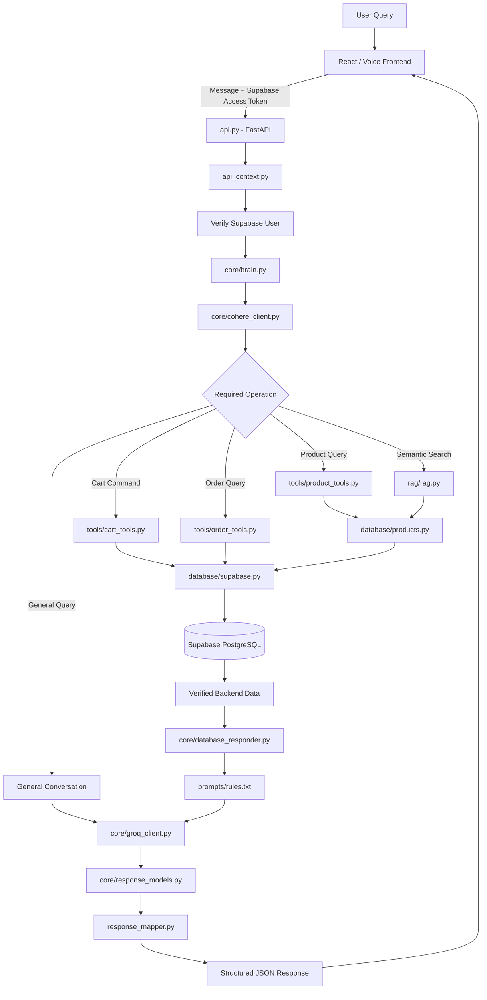

# Grocery Chatbot API

Backend AI service for the EchOo Voice Command Grocery Shopping Assistant.

---

## 1. Approach

The Grocery Chatbot API is designed as a modular conversational AI backend rather than a single text-generation endpoint. FastAPI receives authenticated shopping requests, while Supabase provides the authoritative product, SKU, price, stock, user, cart, and order data.

Each protected request contains a Supabase access token. The API verifies the token and creates a request-scoped authenticated user context before any user-specific operation is executed.

The central `brain.py` coordinates the conversation. Cohere is used for reasoning and determining whether a request requires product tools, cart tools, order tools, semantic RAG retrieval, or a general response. Python executes the selected backend operation.

RAG handles semantic product discovery, while live commerce information is always obtained from Supabase. Groq generates natural-language responses from verified results. Finally, `response_mapper.py` converts internal results into structured frontend-ready JSON containing text, products, variants, alternatives, recommendations, cart information, orders, and safe conversational state.

---

## 2. Explanation

The API enables users to interact with the grocery application using flexible natural-language queries such as **“Show milk under ₹100”**, **“Suggest a healthy snack”**, **“What is in my cart?”**, or **“Show my previous orders.”**

It also supports conversational follow-ups. For example, after finding Maggi, a user can select **“32g”** and then say **“Add it to cart.”** Safe conversational context allows the backend to understand that the final command refers to the previously selected product variant.

Structured tools perform product, cart, and order operations instead of relying on generated text for commerce actions. Supabase remains the source of truth for prices, stock, SKUs, carts, and orders.

The API returns structured JSON rather than only an AI-generated paragraph. This allows the frontend to independently render product cards, variants, alternatives, recommendations, cart information, orders, and assistant messages while maintaining reliable separation between verified backend data and generated conversational responses.

---

## 3. Workflow Architecture



### Repository Architecture

```text
Grocery-Chatbot-API/
│
├── auth/
│   ├── auth.py
│   └── session.py
│
├── core/
│   ├── brain.py
│   ├── cohere_client.py
│   ├── database_responder.py
│   ├── groq_client.py
│   └── response_models.py
│
├── database/
│   ├── products.py
│   ├── supabase.py
│   └── users.py
│
├── prompts/
│   └── rules.txt
│
├── rag/
│   └── rag.py
│
├── tools/
│   ├── cart_tools.py
│   ├── order_tools.py
│   └── product_tools.py
│
├── api_context.py
├── api_models.py
├── api.py
├── config.py
├── Dockerfile
├── requirements.txt
├── response_mapper.py
├── rules.py
└── utils.py
```

### Component Responsibilities

```text
api.py
  |
  |-- Receives /chat request
  |
  v
api_context.py
  |
  |-- Extracts bearer token
  |-- Verifies Supabase user
  |-- Creates request-scoped identity
  |
  v
core/brain.py
  |
  |-- Manages conversation
  |-- Maintains safe client context
  |-- Coordinates AI reasoning
  |
  v
core/cohere_client.py
  |
  |-- Understands user request
  |-- Determines required operation
  |
  +---------------------+---------------------+---------------------+
  |                     |                     |                     |
  v                     v                     v                     v
product_tools.py    cart_tools.py       order_tools.py          rag.py
  |                     |                     |                     |
  +---------------------+----------+----------+---------------------+
                                   |
                                   v
                            database layer
                                   |
                                   v
                               Supabase
                                   |
                                   v
                         Verified backend result
                                   |
                                   v
                      database_responder.py
                                   |
                                   v
                           prompts/rules.txt
                                   |
                                   v
                            groq_client.py
                                   |
                                   v
                         response_models.py
                                   |
                                   v
                         response_mapper.py
                                   |
                                   v
                        Structured API Response
```

---

## 4. Implemented Features

| Category | Feature | Implementation |
|---|---|---|
| API | FastAPI chatbot endpoint | Handles authenticated conversational shopping requests |
| Authentication | Supabase access-token verification | Validates bearer tokens before protected operations |
| Authentication | Request-scoped identity | Authenticated user identity is derived from the verified token |
| Authentication | User isolation | User-specific cart and order operations run within authenticated context |
| NLP | Natural-language understanding | Supports flexible grocery-shopping requests |
| NLP | Conversational follow-ups | Understands short follow-up commands using safe conversation context |
| Reasoning | Cohere reasoning | Determines the appropriate operation required for each query |
| Product Search | Product-name search | Searches grocery products stored in Supabase |
| Product Search | Brand filtering | Supports brand-specific product queries |
| Product Search | Price filtering | Supports queries such as `milk under 100` |
| Product Search | Size filtering | Supports product size and SKU selection |
| Product Search | Variant retrieval | Returns multiple variants belonging to a logical product |
| Product Search | Stock retrieval | Uses live stock information from Supabase |
| Product Search | Price retrieval | Uses authoritative product prices from Supabase |
| RAG | Semantic product discovery | Finds products based on meaning instead of exact text only |
| RAG | Product-description retrieval | Uses descriptive product information for semantic matching |
| RAG | Cohere reranking | Improves relevance of retrieved product candidates |
| Recommendations | Product recommendations | Supports semantic recommendation queries |
| Alternatives | Alternative products | Returns related alternatives when appropriate |
| Cart | View cart | Retrieves the authenticated user's cart |
| Cart | Add product | Adds selected products to the authenticated user's cart |
| Cart | Variant-aware add | Supports adding a specific SKU or size |
| Cart | Remove product | Removes products from the cart |
| Cart | Quantity management | Supports quantity-aware cart commands |
| Orders | Order retrieval | Retrieves authenticated user order data |
| Orders | Latest order | Supports retrieval of the user's latest order |
| Orders | Order details | Returns structured order information |
| Context | Chat history | Maintains limited conversation history |
| Context | Product context | Retains the previously referenced product |
| Context | Variant context | Retains selected SKU or variant information |
| Context | Pending actions | Preserves safe incomplete conversational actions |
| Response | Natural-language response | Groq generates user-facing conversational responses |
| Response | Structured product data | Products and variants are returned separately from text |
| Response | Structured alternatives | Alternatives are returned as dedicated response data |
| Response | Structured recommendations | Recommendations are returned independently |
| Response | Structured cart data | Cart information can be rendered directly by the frontend |
| Response | Structured order data | Order information is returned as structured JSON |
| Response | Response mapping | Internal responses are converted into frontend-safe API models |
| Data Integrity | Supabase source of truth | Live price, stock, SKU, cart, and order data comes from Supabase |
| Rules | Response rules | Prompt rules prevent generated responses from replacing authoritative data |
| Reliability | Input validation | API requests and responses are validated using Pydantic |
| Reliability | Error handling | Handles authentication, database, AI, tool, and invalid-request failures |
| Security | Server-side AI credentials | Cohere, Groq, and Supabase secret keys remain backend-only |
| Deployment | Docker | Backend is containerized |
| Deployment | Render | API is deployed as a public production service |
| Documentation | Swagger / OpenAPI | FastAPI automatically exposes API documentation |

---

## 5. Technology Stack

| Layer | Technology |
|---|---|
| Programming Language | Python |
| API Framework | FastAPI |
| ASGI Server | Uvicorn |
| Request / Response Validation | Pydantic |
| Application Configuration | Pydantic Settings, python-dotenv |
| Authentication | Supabase Auth |
| Database | Supabase PostgreSQL |
| Database Client | Supabase Python |
| AI Reasoning | Cohere |
| Semantic Reranking | Cohere Rerank |
| Response Generation | Groq |
| Groq Model | `openai/gpt-oss-120b` |
| Semantic Retrieval | RAG |
| Search Matching | RapidFuzz |
| HTTP Communication | HTTPX, Requests |
| Conversation Orchestration | Custom Python brain and tools architecture |
| Product Operations | Custom Product Tools |
| Cart Operations | Custom Cart Tools |
| Order Operations | Custom Order Tools |
| Response Mapping | Custom structured response mapper |
| Containerization | Docker |
| Hosting | Render |
| API Documentation | FastAPI Swagger / OpenAPI |
| Version Control | Git, GitHub |

---

## 6. Environment Details

Environment variables are configured locally through `.env` and in production through Render Environment Variables.

Secret credentials are not committed to GitHub.

```env
# Application

APP_NAME=Grocery Chatbot API
APP_ENV=production
APP_HOST=0.0.0.0


# Supabase

SUPABASE_URL=YOUR_SUPABASE_URL
SUPABASE_PUBLISHABLE_KEY=YOUR_SUPABASE_PUBLISHABLE_KEY
SUPABASE_SECRET_KEY=YOUR_SUPABASE_SECRET_KEY


# Cohere

COHERE_API_KEY=YOUR_COHERE_API_KEY
COHERE_MODEL=command-a-plus-05-2026


# Groq

GROQ_API_KEY=YOUR_GROQ_API_KEY
GROQ_API_KEY1=YOUR_SECOND_GROQ_API_KEY
GROQ_API_KEY2=YOUR_THIRD_GROQ_API_KEY

GROQ_MODEL=openai/gpt-oss-120b
GROQ_TEMPERATURE=0.0


# RAG

RAG_MATCH_COUNT=5
RAG_SIMILARITY_THRESHOLD=YOUR_RAG_SIMILARITY_THRESHOLD


# Conversation

MAX_CHAT_HISTORY=10
```

The following values are private server-side credentials and must never be exposed to the frontend or committed to the repository:

```text
SUPABASE_SECRET_KEY
COHERE_API_KEY
GROQ_API_KEY
GROQ_API_KEY1
GROQ_API_KEY2
```

Supabase public configuration can be used by the frontend where required, while privileged database and AI credentials remain available only to the deployed backend.
